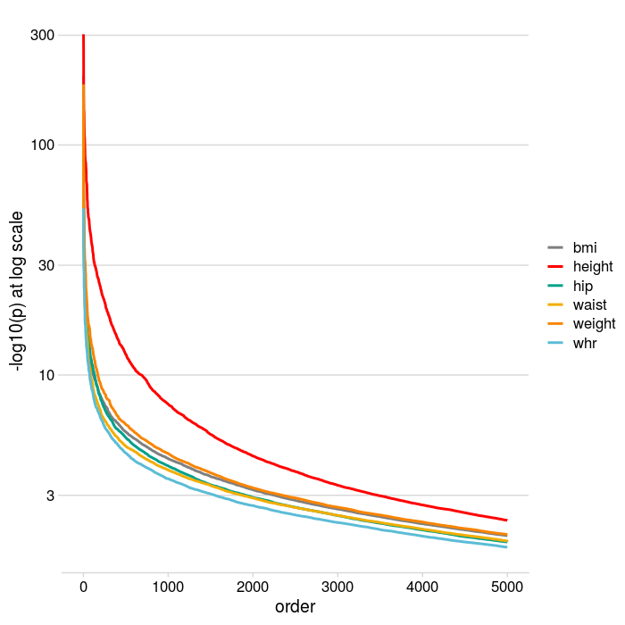
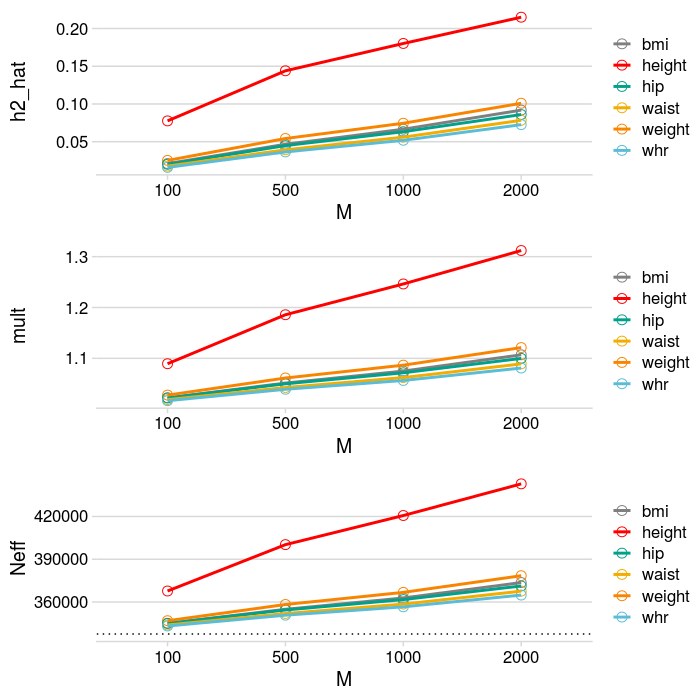

Scripts for the manuscript, 
Ziyatdinov, et al. "Estimating the effective sample size in association studies of quantitative traits." bioRxiv (2019),
https://www.biorxiv.org/content/10.1101/2019.12.15.877217v2.full.

## Analysis steps

### Step 0. UK Biobank data preparation

- 336K unrelated individuals of British ancestry
- &gt;600K genotyped SNPs, autosomes, MAF >0.1%, QC
- 6 traits: bmi, weight, waist, hip, height, whr
  - impute missing trait values by mean (<1% of missingness)
  - project out covariates: age/sex + PC1-20
  - apply rank-based inverse normal transformation

Scripts to process raw UK Biobank data are not shared.

### Step 1. GWAS by Linear Regression (GWAS-LR)

- script: [scripts/08-gwas-lm-top.R](scripts/08-gwas-lm-top.R)
- snakemake command: `snakemake -s sm.py lm`

### Step 3: Clumping with p-values from GWAS-LR

- results: [out/clump/](out/clump/)

### Step 4: Heritability estimation by low-rank LMM

- script: [scripts/04-estimate-h2.R](scripts/04-estimate-h2.R)
- results: [out/h2/](out/h2/)

### Step 5: GWAS by low-rank LMM (GWAS-LMM) using LOCO

- script: [scripts/07-gwas-lmm-loco-top.R](scripts/05-gwas-lmm-top.R)

